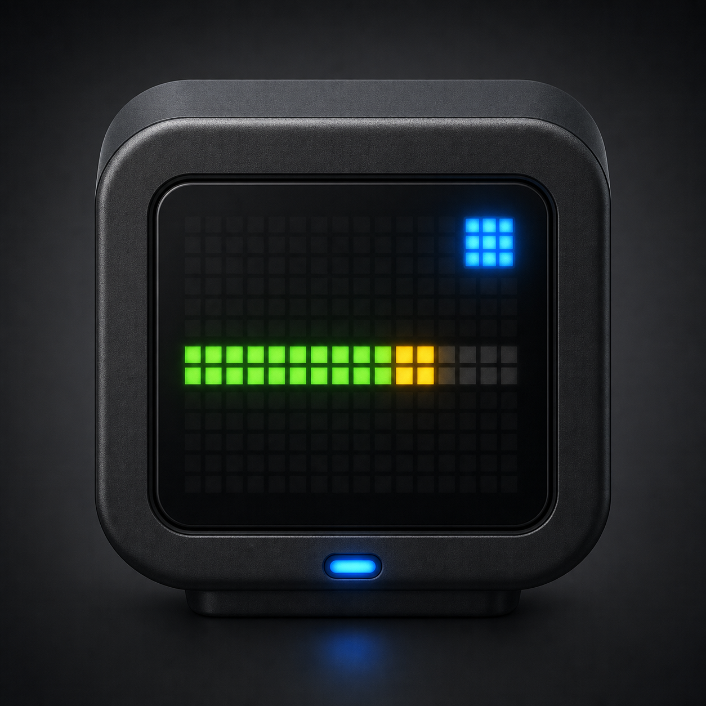

# TC001 Codex Bridge for macOS

**Languages:** [README and usage guides in 17 languages](docs/i18n/README.md) | English | [简体中文](docs/i18n/README.zh-CN.md) | [繁體中文](docs/i18n/README.zh-TW.md) | [Español](docs/i18n/README.es.md) | [Français](docs/i18n/README.fr.md) | [Deutsch](docs/i18n/README.de.md) | [日本語](docs/i18n/README.ja.md) | [한국어](docs/i18n/README.ko.md) | [Português](docs/i18n/README.pt-BR.md) | [Русский](docs/i18n/README.ru.md) | [العربية](docs/i18n/README.ar.md) | [हिन्दी](docs/i18n/README.hi.md) | [বাংলা](docs/i18n/README.bn.md) | [Bahasa Indonesia](docs/i18n/README.id.md) | [Türkçe](docs/i18n/README.tr.md) | [Tiếng Việt](docs/i18n/README.vi.md) | [Italiano](docs/i18n/README.it.md)



A native macOS app that renders Codex quota and activity state on an Ulanzi
TC001 running AWTRIX 3. It supports normal AWTRIX HTTP transport and the
companion `awtrix3-ble` firmware for environments where the clock cannot join
Wi-Fi.

## Display

- Left 1 x 8 bar: five-hour quota remaining
- Right 1 x 8 bar: seven-day quota remaining
- Center lamp: yellow idle, green working, blue waiting for confirmation, red
  error
- Center text alternates `5H 80` for 7 seconds and `7D 65` for 3 seconds
- Five-hour and seven-day quotas can be enabled independently; single-quota
  modes stay on the selected value without page rotation
- Time, date, temperature, humidity, and battery pages can be toggled over
  Wi-Fi or BLE
- The version row opens an updater with automatic and manual GitHub Release
  modes plus SHA-256 and code-signature verification

## Requirements

- macOS 13 or later
- Apple Silicon or Intel Mac, depending on the architecture you build
- Codex desktop app or Codex CLI installed and signed in
- Ulanzi TC001 with AWTRIX 3
- The companion BLE firmware when using Bluetooth transport

## Build

No third-party Swift packages are required.

```bash
./run-tests.sh
./build.sh
open "dist/TC001 Bridge.app"
```

The default build targets the current Mac architecture and uses an ad-hoc
signature. To make a universal release build:

```bash
ARCHS="arm64 x86_64" \
SIGN_IDENTITY="Developer ID Application: Your Name (TEAMID)" \
./build.sh
```

The app, ZIP, and SHA-256 file are written to `dist/`. Public binary releases
should also be notarized; see [release guide](docs/releasing.md).

For connection and day-to-day operation, see the [English usage guide](docs/USAGE.md).

## How it works

The app observes local Codex activity, asks the locally installed Codex
`app-server` for account rate limits, renders a complete 32 x 8 frame, and sends
that frame to AWTRIX. See [architecture](docs/architecture.md) and
[privacy](PRIVACY.md).

An optional native-process bridge listens only on `127.0.0.1:8765`. Its API is
documented in [local bridge API](docs/local-bridge-api.md). Requests carrying a
browser `Origin` header are intentionally rejected.

## Related firmware

The BLE transport requires the separate `awtrix3-ble` firmware repository. The
firmware is derived from AWTRIX 3 and is licensed separately under
CC BY-NC-SA 4.0. Do not copy that license onto this macOS project or assume the
firmware permits commercial distribution.

## Project status

This is an early, unofficial integration. Codex desktop IPC and app-server
interfaces can change, so compatibility may require updates after a Codex
release.

This project is not affiliated with or endorsed by OpenAI, Codex, Ulanzi,
Blueforcer, or AWTRIX.

## License

The macOS application source is available under the [MIT License](LICENSE).
See [NOTICE.md](NOTICE.md) for names, assets, and companion firmware notices.
