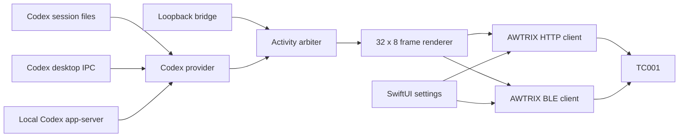

# Architecture

## Ownership boundaries

- Providers convert source-specific events and rate limits into shared models.
- `ActivityArbiter` decides idle, working, waiting, and error precedence.
- `AWTRIXClient` owns rendering and the normal HTTP transport.
- `AWTRIXBLEClient` and `BLEProtocol` own GATT discovery and frame transfer.
- `BridgeStore` coordinates state, display timing, settings, and transport
  fallback for the SwiftUI views.

The firmware receives already-rendered pixels. It does not parse Codex data or
make network requests to OpenAI.
